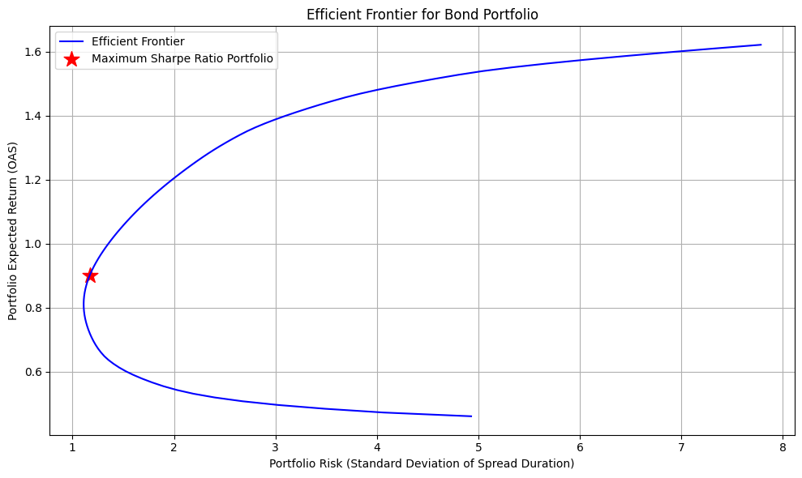
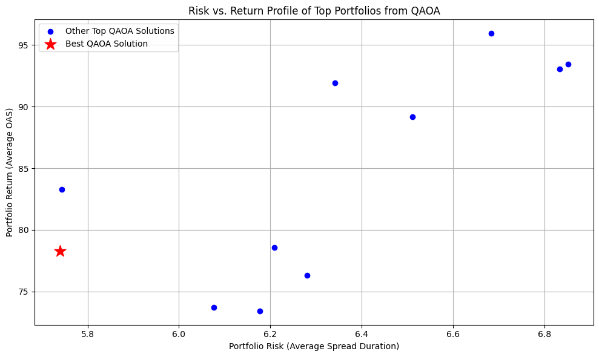

# quantum-portfolio-optimization
A quantum-enhanced solution for the Portfolio Optimization Challenge, developed for the Womanium + WISER Quantum 2025 program using a QAOA-based algorithm.

# Quantum-Enhanced Portfolio Optimization

* **Project Name:** Quantum-Enhanced Portfolio Optimization    
* **Team Name:** $$Qubit^3$$     
* **Team Members:**    
    * Sadiya Ansari (WISER ID: gst-Ud0icMdXMU49utv)    
    * Rudraksh Sharma (WISER ID: gst-9CHiRrQJXjQhyij)    
    * Van Binh VU (WISER ID: gst-gASeCBd9WmUPOAX)    
  
---

## 2. Project Summary

This project addresses the Portfolio Optimization Challenge by prototyping a quantum-enhanced solution to a complex, constraint-heavy asset selection problem. Classical optimization tools face limitations in speed and scalability when dealing with high-dimensional financial models. Our goal is to demonstrate how hybrid quantum-classical algorithms can tackle these problems, specifically by framing the task as a **Quadratic Unconstrained Binary Optimization (QUBO)** problem and solving it with the **Quantum Approximate Optimization Algorithm (QAOA)**.

Our approach involves a multi-step pipeline. First, we translate a realistic set of financial objectives and constraints into a QUBO model. The primary objective is to select a portfolio of assets that matches the characteristics of specific risk buckets to a target value. This is a quadratic objective function that penalizes deviation from the target. We simultaneously enforce a linear constraint—selecting a fixed number of assets for the final portfolio—by adding a quadratic penalty term to the Hamiltonian. This process successfully converts the constrained optimization problem into an unconstrained format suitable for quantum annealers or gate-based quantum computers.

The core of our solution lies in solving this QUBO using **Qiskit's QAOA implementation**. We convert the QUBO matrix into an equivalent Ising Hamiltonian, which represents the problem's cost function. The QAOA algorithm is then run on a high-performance classical simulator (`matrix_product_state`) to find the ground state of this Hamiltonian. The ground state, represented by a binary bitstring, corresponds to the optimal asset selection that minimizes our cost function. The result is a concrete selection of assets that represents the near-optimal portfolio.

To validate our quantum solution, we developed a classical benchmark based on **Modern Portfolio Theory (MPT)**. This classical solver uses `scipy.optimize` to find the portfolio with the maximum Sharpe Ratio, a standard industry metric for risk-adjusted return. It also calculates the efficient frontier, visualizing the optimal trade-off between risk and return. While the MPT solver optimizes for continuous asset weights and the QAOA solver optimizes for discrete asset selection, the comparison provides valuable context. Our project successfully demonstrates a complete workflow from problem formulation to quantum execution and classical validation, highlighting the potential of quantum algorithms to provide powerful solutions for complex financial modeling tasks.

---

## 3. Project Presentation

Our final presentation deck, which provides a high-level overview of our approach and results, can be found in the `docs` folder:   

* **[Link to Your Presentation](./docs/Presentation.pdf)**  


---

## 4. Repository Structure

Our project is organized into the following directories for clarity and reproducibility:

```
.
├── data/
│   ├── assets.csv                  # Raw input data for all bonds
│   ├── asset_list.txt              # Output: List of bond ISINs for the QUBO
│   ├── qubo_matrix.txt             # Output: The generated QUBO matrix
│   ├── qubo_offset.txt             # Output: The QUBO offset value
│   └── optimal_asset_allocation.csv # Output: Results from the classical solver
├── docs/
│   ├── Presentation.pdf              # Project presentation deck
|   └── QUBO_formulation.pdf          # QUBO formulation
├── notebooks/
│   └── main_demonstration.ipynb    # Main notebook combining all steps
├── src/
│   ├── problem_converter.py        # Script to formulate the QUBO
│   ├── quantum_solver.py           # Script to solve the QUBO with QAOA
│   └── classical_solver.py         # Script for the classical MPT benchmark
├── .gitignore
├── LICENSE
└── README.md
```

---

## 5. How to Run the Solution

To replicate our results, please follow the steps below.

### Prerequisites

Ensure you have Python 3.8+ and the following libraries installed:
* `qiskit`
* `qiskit_aer`
* `qiskit_algorithms`
* `numpy`
* `pandas`
* `matplotlib`
* `scipy`

### Installation

1.  Clone the repository:
    ```bash
    git clone [https://github.com/sadieeae/quantum-portfolio-optimization.git](https://github.com/sadieea/quantum-portfolio-optimization.git)
    cd your-repo-name
    ```
2.  (Recommended) Create a `requirements.txt` file with the libraries listed above and install them:
    ```bash
    pip install -r requirements.txt
    ```

### Execution Workflow

The project is designed to be run in a sequence. You can run the individual scripts from the `src` folder or use the combined `main_demonstration.ipynb` notebook.

**Step 1: Formulate the QUBO Problem**
Run the first part of the `main_demonstration.ipynb` notebook (or `src/problem_converter.py`). This will use `data/assets.csv` to generate the QUBO model.

* **Inputs:** `data/assets.csv`
* **Outputs:**
    * `data/qubo_matrix.txt`
    * `data/asset_list.txt`
    * `data/qubo_offset.txt`

**Step 2: Solve with the Quantum Algorithm (QAOA)**
Run the second part of the `main_demonstration.ipynb` notebook (or `src/quantum_solver.py`). This loads the generated QUBO files and solves for the optimal portfolio.

* **Inputs:** The files generated in Step 1.
* **Outputs:**
    * A risk-return plot saved as `qaoa_risk_return_plot.png`.
    * Console output detailing the optimal objective value and the selected assets.

**Step 3: Run the Classical Benchmark**
To generate the classical benchmark for comparison, run the `classical_solver.py` script.

* **Inputs:** `data/assets.csv`
* **Outputs:**
    * An efficient frontier plot saved as `efficient_frontier.png`.
    * The optimal portfolio allocation saved to `data/optimal_asset_allocation.csv`.

---

## 6. Results & Analysis

We successfully implemented both the quantum and classical solvers, yielding distinct but valuable insights.

### Classical Benchmark: Efficient Frontier (MPT)

The classical solver, based on Modern Portfolio Theory, produced the efficient frontier shown below. This curve represents the set of portfolios with the highest expected return for a given level of risk. The star indicates the single portfolio with the maximum Sharpe Ratio. This approach provides a continuous weighting for **all 31 assets** in the universe.



### Quantum Solution: Optimal Asset Selection (QAOA)

The QAOA solver tackles the discrete selection problem: **which 10 bonds** should be included in the portfolio to best satisfy the QUBO cost function. The plot below shows the risk-return profile of the top 10 portfolios found by QAOA, sorted by their measurement probability. The star marks the single best solution with the highest probability.



### Comparison

* The **classical MPT solver** optimizes for risk-adjusted returns across all assets, resulting in a fully-allocated portfolio with continuous weights. It answers the question: "How much of every asset should I hold?"
* The **quantum QAOA solver** optimizes for a specific set of business constraints encoded in the QUBO, resulting in a discrete selection of assets. It answers the question: "Which 10 assets should I choose?"

Our quantum solution successfully identified a portfolio of 10 bonds that minimizes the objective function, demonstrating the viability of QAOA for this complex, real-world financial use case.

---

## 7. References and Acknowledgements

* This project was developed as part of the **Womanium WISER Quantum 2025** program.
* The quantum algorithms were implemented using IBM's **Qiskit** library.
* The classical benchmark and data analysis were performed using **NumPy**, **Pandas**, and **SciPy**.
* We thank the organizers of Womanium and the mentors for this valuable opportunity.
